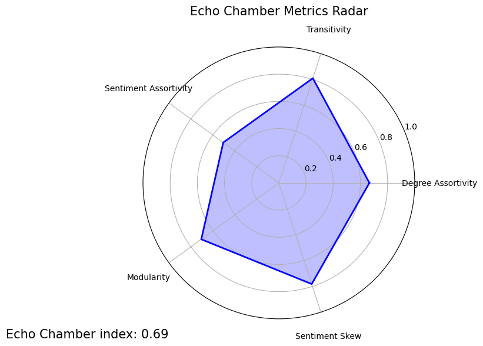

# Echo Chamber Index for Reddit Communities

This project analyses Reddit communities using network and sentiment analysis to measure the extent of echo chambers.

## Introduction
### What is an Echo Chamber??

An **Echo Chamber** is a community where users interact primarily with like-minded users, producing highly uniform sentiment, structurally clustered groups, and minimal exposure to opposing views.

### Why does this matter?

Online communities shape opinions and influence decisions, making it important to understand how these discussions evolve, Detection echo chambers helps identify when conversations are insular or measuring genuine consumer sentiment. This insight can improve product strategy, marketing campaigns and overall audience undersanding. 

### What does this project do?

This project measures the extent to which subreddit discussions act as echo chambers. Using Reddit data, i built interaction graphs between users and combined them with sentiment analysis. By looking at metrics like modularity, clustering and sentiment alignment, the project identifies whether a subreddit fosters diverse interactions or tends towards reinforcing like-minded opinions.

## Methodology

The data pipeline consists of the following:

1. Data Collection
    1. Collecting reddit comments utilising PRAW
    2. Cleaning out irrelevant data (bots, deleted users, off topic disucssion)
    3. Sentiment analysis utilising Huggingface transformers
2. Network Analysis
    1. Build bipartite user-post graph
    2. project onto user-user graph
    3. Detect communities using Leiden algorithm
3. Metric Computation
    - **Degree Assortivity:** tests if high degree (very active) users interact more with other high degree users. 
    - **Sentiment Skew:**  Shows whether the overall converation is heavily tilted towards positive or negative sentiment
    - **Sentiment Assortivity:** tests if users tend to interact more with others who share the same sentiment. 
    - **Modularity:** quantifies how strongly the graph splits into tight sub communities. 
    - **Transitivity:** fraction of user triplets that are all connected, showing how tightly users interact with each other.
4. Visualisations
    - Spider plots, Community graphs, Histograms, Bar Chars

## Results/Visualisations

#### The following example visualisations are from r/NintendoSwitch
