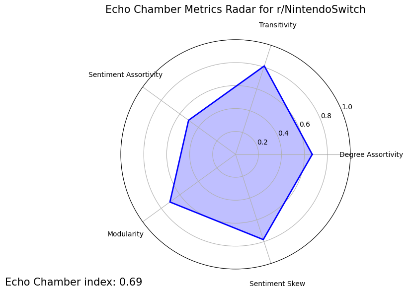
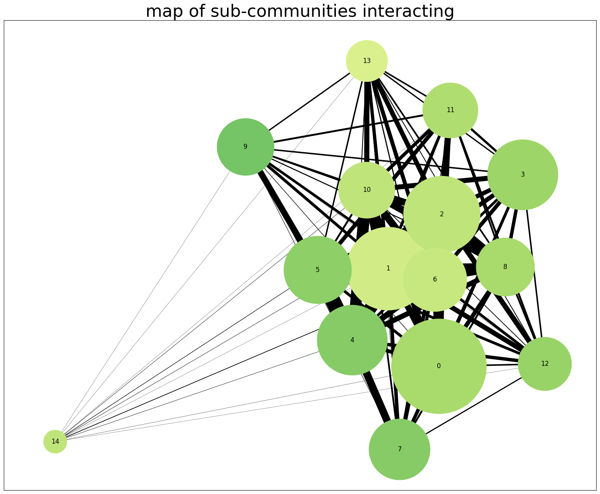
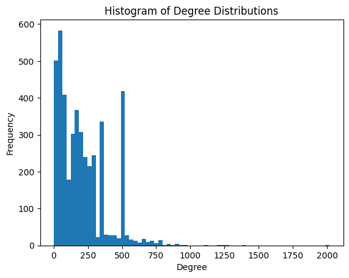
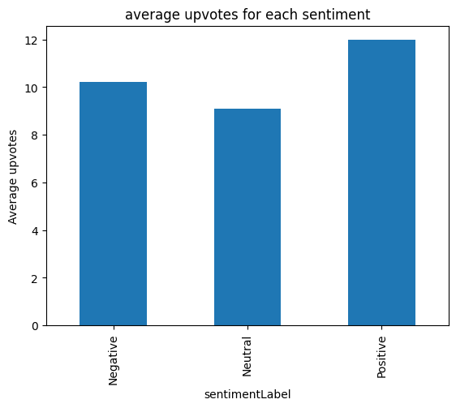
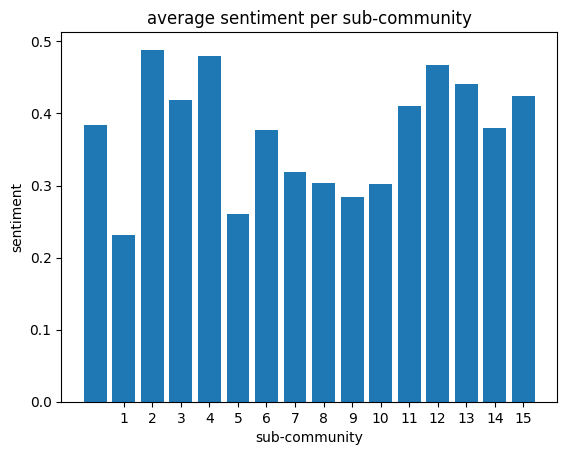

# Echo Chamber Index for Reddit Communities

This project analyses Reddit communities using network and sentiment analysis to measure the extent of echo chambers.

## Introduction
### What is an Echo Chamber??

An **Echo Chamber** is a community where users interact primarily with like-minded users, producing highly uniform sentiment, structurally clustered groups, and minimal exposure to opposing views.

### Why does this matter?

Online communities shape opinions and influence decisions, making it important to understand how these discussions evolve, Detection echo chambers helps identify when conversations are insular or measuring genuine consumer sentiment. This insight can improve product strategy, marketing campaigns and overall audience undersanding. 

### What does this project do?

This project measures the extent to which subreddit discussions act as echo chambers. Using Reddit data, i built interaction graphs between users and combined them with sentiment analysis. By looking at metrics like modularity, clustering and sentiment alignment, the project identifies whether a subreddit fosters diverse interactions or tends towards reinforcing like-minded opinions.

## Methodology

The data pipeline consists of the following:

1. Data Collection
    1. Collecting reddit comments utilising PRAW
    2. Cleaning out irrelevant data (bots, deleted users, off topic disucssion)
    3. Sentiment analysis utilising Huggingface transformers
2. Network Analysis
    1. Build bipartite user-post graph
    2. project onto user-user graph
    3. Detect communities using Leiden algorithm
3. Metric Computation
    - The following metrics are measured 0-1.
        - 1 = Like an echo chamber
        - 0 = Unlike an echo chamber
    - **Degree Assortivity:** tests if high degree (very active) users interact more with other high degree users. 
    - **Sentiment Skew:**  Shows whether the overall converation is heavily tilted towards positive or negative sentiment
    - **Sentiment Assortivity:** tests if users tend to interact more with others who share the same sentiment. 
    - **Modularity:** quantifies how strongly the graph splits into tight sub communities. 
    - **Transitivity:** fraction of user triplets that are all connected, showing how tightly users interact with each other.
4. Visualisations
    - Spider plots, Community graphs, Histograms, Bar Chars

## Results/Visualisations

### The following example visualisations are from r/NintendoSwitch
#### Echo Chamber Index- Spider Graph 

- The **Echo Chamber Index** is the average of these metrics

####  Map of sub-communities Interacting

- This graph shows the subreddit split into 'sub groups' of users, the size of each node indicates the size of the sub group
- The color indicates the sentiment of the sub group
- The size of the edges between sub communities indicates how well connected their users are between those communities
    - Looking at node 14 (bottom left), you can see by its thin edges that its an isolated sub group of users from the main cluster, signaling a potential "secondary mini echo chamber" 

### Histogram of Degree Distributions

- Y axis: user degree (number of unique users they directely interact with through shared posts)
- X axis: Frequency (how many users have that degree)
- Highlights whether most users are only loosely connected (low degree) or if there are a few 'hub' users with very high connectivity
- Highlights the quantity and difference between casual participants and highly active 'core' members

### Average upvotes per sentiment

- Showcases how each sentiment is rewarded/punished compared to other sentiments

### Average sentiment per sub-community

-  The sentiment ranes from -1 (negative) to +1 (positive), though this chart is zoomed into the observed range for readability
- Each sub community, represented in the x axis, correlelates with the each sub community measured in the 'Map of sub-communities Interacting'

## Limitations
#### -API rate limits
The analysis is limited by Reddits' API rate limits. Large subreddits require throttling (this should only apply for the ~10 largest subreddits), which can slow data collection.Users need their own reddit developer credentials to replicate results.
#### -Sarcasm and Humor detection
Sentiment analysis may misinterpret sarcastic or humerous posts, common on subreddits like r/Memes. This can skew sentiment metrics, as the model primarily detects literal sentiment.
#### -Sampling limitation
Metrics are calculated from a subset of posts and comments (e.g 100-200 recent posts), not the entire subreddit history. This means they approximate the echo chamber effect rather than capturing full, long-term interaction patterns.

## -Installation/Usage
1. Make sure you have **Python 3.10+** installed
2. clone the repository:
    ```
    git clone https://github.com/T-Coding-Byte/EchoDetection.git
    cd EchoDetection
    ```
3. Install dependancies listed in requirements.txt
    ```
    pip install r requirements.txt
    ```
    It is reccomented to use a **Virtual Environment** to avoid conflicts with other projects.
4. Reddit API access
    1. Create a Reddit account if you dont have one.
    2. go to [Reddit app preferences](https://www.reddit.com/prefs/apps) (make sure you're logged into your account )
    3. click 'create app'
    4. name and description can be anything
    5. out of the 3 app type choice select 'script'
    6. 'about url' can be anything
    7. 'redirect url' put in http://localhost:8080
    8. You should be presented with your client id and client secret
5. create a praw.ini file with the following format
    ```ini
    [project]
    client_id=<YOUR_CLIENT_ID>
    client_secret=<YOUR_CLIENT_SECRET>
    username=<YOUR_USERNAME>
    password=<YOUR_PASSWORD>
    user_agent=<YOUR_USER_AGENT>
    ```
    - username and poassword are your reddit username and password here
    - useragent should be "project-name:echo (by /u/yourusername)" (input your reddit username here)
6. Run 01_data_collection.ipynb, and input the name of your desired subreddit, (this is case and spelling sensitive)
7. Once 01_data_collection.ipynb is done, run 02_network_analysis.ipynb and once that finishes run 03_visualisations.ipynb for your visualisations and metrics

## Possible Extensions
- Extend analysis accross multiple subreddits sharing a topic at once for cross community comparisons. 
- Experiment/fine tune with more advanced NLP models for for sarcasm.
- Explore Scalability for very large subreddits without heavy throttling.

## License

This project is licensed under the MIT License - see the [LICENSE](LICENSE) file for details.
